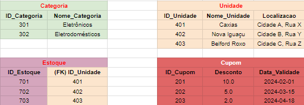

# DiegoSamim-PAME-23.2-Entrega-3-Diego-Samim

## OBS

O controle usuario e produto possui uma lista para simular um banco de dados, porém por tempo esse commit não tera em todos apenas retorna strings para simular um funcionamento.

## Objetivo

Construir a arquitetura de um banco de dados, realizando um
Diagrama de Entidade e Relacionamento, na plataforma “Lucidchart”, e o molde de uma API REST,
com suas rotas, na linguagem de programação Typescript

### Andamento

- [x] Modelagem do banco de dados no LucidChart 
- [x] Criar o código Base no nest 
- [x] Criar as entidades 
- [x] Estabelecer as rotas referentes a cada requisito (função)

## Rotas

Cliente:
- [x] Cadastro
  -  EndPoint: POST http://localhost:3000/usuario
  -  Descrição: Recebe um json com (nome; tipo; email; senha;) e salva no banco de dados (listaUsuario)
- [x] Visualizar Perfil
  - EndPoint: GET http://localhost:3000/usuario/{id}
  - Descrição: Retorna um json com os dados do cliente com aquele id
- [x] Visualizar Produtos
  - EndPoint: GET http://localhost:3000/produto
  - Descrição: Retorna um json com todos os produtos
- [x] Visualizar Produtos de uma unidade 
  - EndPoint: GET http://localhost:3000/produtos-em-estoque/filtro/estoque?idEstoque=1
  - Descrição: Retorna um JSON com os produtos disponíveis em uma unidade específica, utilizando o ID do estoque como filtro.
- [x] Realizar Compras*:
  - Realizar Comprar
    - EndPoint: POST http://localhost:3000/pedido
    - Descrição: Cria um novo pedido ao realizar uma compra. Recebe as informações da compra, como produtos, quantidades, etc.
  - Adicionar na Tabela Itens_Comprados os itens do carrinho pegando o id do pedido
    - EndPoint: POST http://localhost:3000/itens-comprados
    - Descrição: Adiciona os itens do carrinho à tabela Itens_Comprados associando-os ao pedido recém-criado.
  - Atualiza Status do Pedido
    - EndPoint: PATCH http://localhost:3000/pedido/{id}
    - Descrição: Atualiza o status do pedido, como por exemplo, marcando-o como "Aguardando Pagamento" ou "Concluido".
  - Limpa o carrinho (DELETE Carrinho com filtro do id Usuario)
    - Endpoint: http://localhost:3000/carrinho/limpar/:id_usuario
    - Descrição: Remove todos os itens do carrinho associados ao usuário, limpando-o para futuras compras.
- [x] Vizualizar pedidos 
  - EndPoint: GET http://localhost:3000/pedidos?idUsuario={idUsuario}
  - Descrição: Retorna um JSON com os pedidos do usuário com o ID especificado.
- [x] Inserir, editar, vizualizar e excluir produtos de um carrinho ( POST, PUT, GET, DELETE Carrinho)
  - EndPoint: POST http://localhost:3000/carrinho
  - Descrição: Adiciona um produto ao carrinho do usuário.
  - EndPoint: PUT http://localhost:3000/carrinho/{idCarrinho}
  - Descrição: Atualiza a quantidade de um produto no carrinho.
  - EndPoint: GET http://localhost:3000/carrinho?idUsuario={idUsuario}
  - Descrição: Retorna um JSON com os produtos no carrinho do usuário.
  - EndPoint: DELETE http://localhost:3000/carrinho/{idCarrinho}
  - Descrição: Remove um produto do carrinho do usuário.
- [x] Vizualizar cupons
  - EndPoint: GET http://localhost:3000/cupom
  - Descrição: Retorna um JSON com todos os cupons disponíveis.
- [x] Vizualizar categorias 
  - EndPoint: GET http://localhost:3000/categoria
  - Descrição: Retorna um JSON com todas as categorias disponíveis.
- [x] Vizualizar produtos de uma categoria (GET Produtos com filtro em categoria)
  -  EndPoint: GET http://localhost:3000/produto?categoria={idCategoria}
  -  Descrição: Retorna um JSON com os produtos da categoria especificada.
- [x] Excluir conta (DELETE Usuario)
  -  EndPoint: DELETE http://localhost:3000/usuario/{idUsuario}
  -  Descrição: Remove a conta do usuário com o ID especificado.  

Vendedor:
- [x] Inserir, editar, vizualizar e excluir produtos ( POST, PUT, GET, DELETE Produto)
  - EndPoint: http://localhost:3000/produto
  - Descrição: Permite realizar operações de criação (POST), atualização (PUT), visualização (GET) e exclusão (DELETE) de produtos.
- [x] Vizualizar todos os clientes
  - EndPoint: GET http://localhost:3000/usuario/clientes
  - Descrição: Retorna todos os usuarios do tipo cliente
- [x] Vizualizar os pedidos realizados
  - EndPoint: GET http://localhost:3000/pedido
  - Descrição: Permite visualizar todos os pedidos realizados.
- [x] Inserir, editar, vizualizar e excluir cupons ( POST, PUT, GET, DELETE Cupom)
  - EndPoint: http://localhost:3000/cupom
  - Descrição: Permite realizar operações de criação (POST), atualização (PUT), visualização (GET) e exclusão (DELETE) de cupons.
- [x] Inserir, editar, vizualizar e excluir categorias para os produtos ( POST, PUT, GET, DELETE Categoria)
  - EndPoint: http://localhost:3000/categoria
  - Descrição: Permite realizar operações de criação (POST), atualização (PUT), visualização (GET) e exclusão (DELETE) de categorias para os produtos.
- [x] Gerenciar estoque de cada unidade ( POST, PUT, GET, DELETE Estoque)
  - EndPoint: http://localhost:3000/estoque
  - Descrição: Permite realizar operações de criação (POST), atualização (PUT), visualização (GET) e exclusão (DELETE) de estoque para cada unidade.

### Modelagem:

Além do LucidChart, para um vizualização melhor criei alguns exemplos no excel para auxiliar na modelagem do banco de dados.  
(Cada entidade possui uma cor especifica e chaves estrangeiras possuem a cor da entidade a qual faz referência)

- Categoria: 
  - ID_Categoria, 
  - Nome_Categoria
- Estoque: 
  - ID_Estoque, 
  - (FK) ID_Unidade
- Unidade: 
  - ID_Unidade, 
  - Nome_Unidade, 
  - Localizacao
- Cupom: 
  - ID_Cupom,  
  - Desconto, 
  - Data_Validade
- Usuario: 
  - ID_Usuario, 
  - Nome, 
  - Tipo, 
  - Email, 
  - Senha
- Produto: 
  - ID_Produto, 
  - Nome_Produto, 
  - Preco, 
  - Descricao, 
  - (FK) Categoria
- Produtos em estoque: 
  - ID_IE, 
  - (FK) ID_Estoque, 
  - (FK) ID_Produto, 
  - Quantidade
- Carrinho: 
  - ID_Carrinho,	
  - (FK) ID_Usuario,
  - (FK) ID_Produto,
  - Quantidade
- Pedido: 
  - ID_Pedido
  - ID_Usuario
  - Data_Pedido
  - Status
  - ID_Cupom
- Produtos Comprados: 
  - ID_IE	
  - (FK) 
  - ID_Pedido	
  - (FK) 
  - ID_Produto	Quantidade