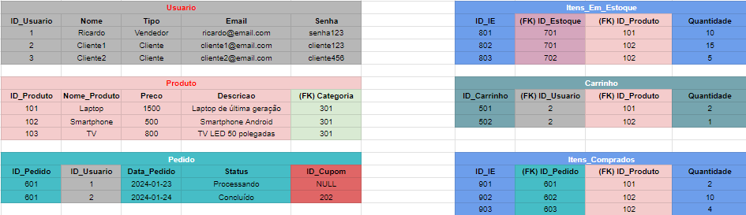

# DiegoSamim-PAME-23.2-Entrega-3-Diego-Samim

## Objetivo

Construir a arquitetura de um banco de dados, realizando um
Diagrama de Entidade e Relacionamento, na plataforma “Lucidchart”, e o molde de uma API REST,
com suas rotas, na linguagem de programação Typescript

### Andamento

- [x] Modelagem do banco de dados no LucidChart 
- [x] Criar o código Base no nest 
- [x] Criar as entidades 
- [ ] Estabelecer as rotas referentes a cada requisito (função)

## Rotas

Cliente:
- [x] Cadastro
  -  EndPoint: http://localhost:3000/usuario
  -  Descrição: Recebe um json com (nome; tipo; email; senha;) e salva no banco de dados (listaUsuario)
- [x] Visualizar Perfil
  - EndPoint: http://localhost:3000/usuario/{id}
  - Descrição: Retorna um json com os dados do cliente com aquele id
- [x] Visualizar Produtos
  - EndPoint: http://localhost:3000/produto
  - Descrição: Retorna um json com todos os produtos
- [x] Visualizar Produtos de uma unidade 
  - EndPoint: http://localhost:3000/produtos-em-estoque/filtro/estoque?idEstoque=1
- [ ] Realizar Compras:
    Realizar Comprar ( POST Pedidos)
    Adicionar na Tabela Itens_Comprados os itens do carrinho pegando o id do pedido (POST Itens_Comprados)
    Atualiza Status do Pedido (PUT Pedido)
    Limpa o carrinho (DELETE Carrinho com filtro do id Usuario)
- [] Vizualizar pedidos ( GET Pedido por id usuario)
- [ ] Recupera os pedidos do usuario
- [ ] Inserir, editar, vizualizar e excluir produtos de um carrinho ( POST, PUT, GET, DELETE Carrinho)
- [ ] Vizualizar cupons ( GET Cupom)
- [ ] Vizualizar categorias ( GET Categoria)
- [x] Vizualizar produtos de uma categoria (GET Produtos com filtro em categoria) 
- [ ] Vizualizar produtos com cupom (?)
- [ ] Excluir conta (DELETE Usuario)

Vendedor:
- [x] Inserir, editar, vizualizar e excluir produtos ( POST, PUT, GET, DELETE Produto)
- [x] Vizualizar todos os clientes
  - EndPoint: http://localhost:3000/usuario/clientes
  - Descrição: Retorna todos os usuarios do tipo cliente
- [ ] Vizualizar os pedidos realizados (Get Pedidos)
- [ ] Inserir, editar, vizualizar e excluir cupons ( POST, PUT, GET, DELETE Cupom)
- [ ] Inserir, editar, vizualizar e excluir categorias para os produtos ( POST, PUT, GET, DELETE Categoria)
- [ ] Gerenciar estoque de cada unidade ( POST, PUT, GET, DELETE Estoque)

### Modelagem:

Além do LucidChart, para um vizualização melhor criei alguns exemplos no excel para auxiliar na modelagem do banco de dados.  
(Cada entidade possui uma cor especifica e chaves estrangeiras possuem a cor da entidade a qual faz referência)

- Categoria: 
  - ID_Categoria, 
  - Nome_Categoria
- Estoque: 
  - ID_Estoque, 
  - (FK) ID_Unidade
- Unidade: 
  - ID_Unidade, 
  - Nome_Unidade, 
  - Localizacao
- Cupom: 
  - ID_Cupom,  
  - Desconto, 
  - Data_Validade
- Usuario: 
  - ID_Usuario, 
  - Nome, 
  - Tipo, 
  - Email, 
  - Senha
- Produto: 
  - ID_Produto, 
  - Nome_Produto, 
  - Preco, 
  - Descricao, 
  - (FK) Categoria
- Produtos em estoque: 
  - ID_IE, 
  - (FK) ID_Estoque, 
  - (FK) ID_Produto, 
  - Quantidade
- Carrinho: 
  - ID_Carrinho,	
  - (FK) ID_Usuario,
  - (FK) ID_Produto,
  - Quantidade
- Pedido: 
  - ID_Pedido
  - ID_Usuario
  - Data_Pedido
  - Status
  - ID_Cupom
- Produtos Comprados: 
  - ID_IE	
  - (FK) 
  - ID_Pedido	
  - (FK) 
  - ID_Produto	Quantidade